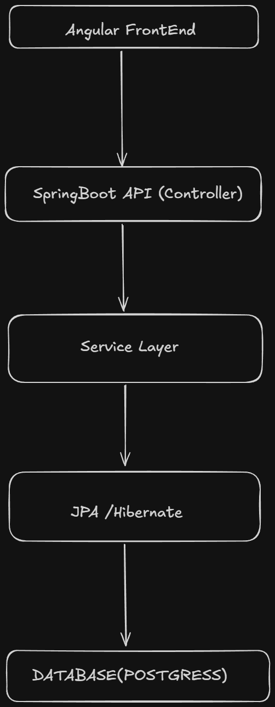

<h1 align="center">Knowledge Platform</h1>

  

A scalable backend-first knowledge management system evolving into an AI-powered learning and retrieval platform.

## 🛠 Tech Stack

  

## 🏗 Architecture

🚀 Project Vision

The Knowledge Platform is designed to solve a very real problem:

❗ Unstructured learning and scattered knowledge across notes, repos, and documentation.

This project aims to:

Centralize knowledge

Structure it for retrieval

Make it scalable for real-world usage

Evolve into an AI-powered knowledge assistant

-------------  --------------------

🎯 Problem Statement

Developers and students often face:

Fragmented notes across platforms

No structured way to retrieve information

Poor searchability of concepts

Lack of reusable knowledge systems

✅ Solution

This platform provides:

Structured knowledge storage (articles-based)

Clean API-driven architecture

Extensible backend for future AI integration

Foundation for search, tagging, and intelligent retrieval

--------------------------------------------------------
🌍 Real-World Use Cases
1. Personal Knowledge System

Store coding notes

Track learning

Build structured knowledge

2. Interview Preparation Platform

Store DSA problems

Tag by topic

Add solutions

3. Internal Company Wiki
   Engineering documentation

API references

Onboarding material

-------------------------------------------------

🧱 Current Implementation (Day 1 – Day 8)
✅ Backend Core (Spring Boot)

REST API built using Spring Boot

Layered architecture:

Controller

Service

Repository

Entity

--------------------------------------------------------

✅ Database & ORM

Integrated Spring Data JPA

ORM using Hibernate

Relational database design (Articles)

✅ Entity Design

Article entity with:

ID

Title

Content

Metadata (timestamps ready for extension)

-------------   --------------------------------------------

✅ DTO Architecture

Separation between Entity and API layer

Prevents overexposure of database schema

Enables future API evolution

✅ Validation Layer

Implemented using Jakarta Bean Validation

✅ Global Exception Handling

Centralized error handling using:

Standardized API error responses

Cleaner controllers

✅ CRUD Operations

Fully implemented APIs:

Create Article

Read Articles

Update Article

Delete Article

✅ Performance Awareness

Identified and resolved N+1 query issue

Improved query efficiency using JPA strategies

------------------------------------------------

